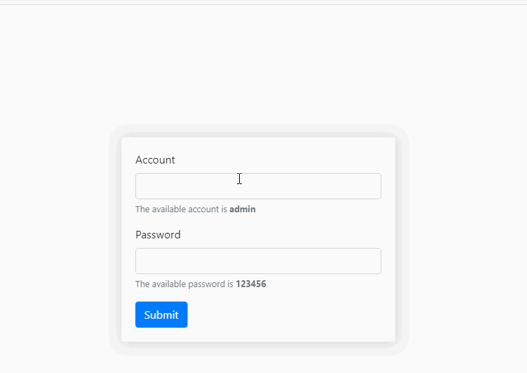
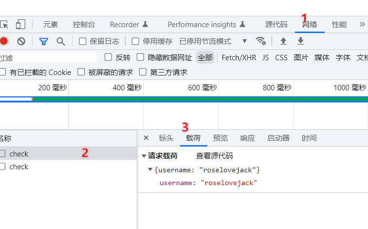

# Ajax-day01

> 今天是Ajax第一天


## 自我介绍

> 先简单的自我介绍一下哈

1. 我叫什么?

   1. 文梦月
   
4. 负责哪几个阶段的课程?

   1. Ajax、小程序+Uniapp、TS、React


## 学习目标

> 今天的学习目标


### 能够通过 **Ajax** 和 **服务器**通讯





# 服务器

### 服务器

简而言之就是在网上提供**服务**的**计算机**

* 平时一般见不到，但咱们经常和他保持着联系?比如

  1. 微信,QQ--->获取聊天的信息(**微信的服务器**)

  1. 听歌软件(网易云,QQ音乐)--->获取歌曲的信息(**音乐服务器**)

  1. **浏览器**---->获取网页信息(**网页服务器**)
  


### 通讯过程

以咱们用的最多的**浏览器**为例,和服务器通讯的过程就像**聊微信**?

1. **浏览器:**输入URL地址-->**请求**
2. **服务器:**接收请求并返回对应的资源-->**响应**
3. **浏览器:**接收并解析响应内容
4. 可以在浏览器开发者界面的`network`分类查看


### 试一下

提供一台可以访问的服务器

在互联网可以访问的电脑(云服务器)

```bash
http://autumnfish.cn:8080/shake.html
http://ajax-api.itheima.net:80/public/images/0.webp
http://ajax-api.itheima.net:80/api/news
```


### 服务器相关概念

本节咱们介绍了一些和服务器相关的知识,也尝试访问了事先准备好的服务器,那么:

1. 我们自己的电脑能否成为服务器?
   1. 可以

2. 在浏览器输入什么即可访问对应的服务器?
   1. 地址(**URL)**


## URL地址

> 浏览器知道了服务器的地址就可以访问服务器啦,别小看了这个地址,包含了很多内容。
>
> 这个地址叫做统一资源定位器（**URL**）是指定在 Internet 上可以找到资源的位置的文本字符串。
>


http://ajax-api.itheima.net:80/public/images/0.webp

**协议名:** 

1. **http://** ,**https://(会加密,安全一些)** 
2. 协议是网络协议的简称，用来保证通信的双方能读懂彼此发送过来的消息内容。

**主机:**

1.  主机指的是在互联网（局域网）中提供服务的设备，可以通过ip或者域名访问
2.  如果访问的是**域名**：dns服务器解析--》**ip地址**

**端口号**

1. 端口号是 **0 - 65535** 之间的整数
3. 一个端口一次只能**被一个服务**占用(**做核酸?**)
4. **http**默认的端口是**80**，可以省略不写
5. **https**默认的端口是**443**，可以省略不写

**服务器上的资源:**

1.  `/public/images/0.webp`


### URL地址

这一节咱们介绍了`URL`地址,咱们来看看这个地址http://ajax-api.itheima.net:80/api/news

1. 协议名,主机名,端口,资源路径分别是？
   1. http:协议
   2. ajax-api.itheima.net:主机名
   3. 80:端口
   4. /api/news(**数据也是资源**)
      1. 资源路径

2. 地址中的端口号80是否可以省略？
   1. 可以
   2. 443->https


# ajax

## Ajax概念及体验

> 在浏览器的地址栏中输入**url地址**即可和服务器进行通讯，但是这种方式页面会**重新加载（刷新）**，而咱们本节要学习的Ajax可以在**不重新加载（刷新）页面**的情况下与服务器通信！
>
> [传送门:mdn-ajax](https://developer.mozilla.org/zh-CN/docs/Web/Guide/AJAX/Getting_Started)

### 概念

* 使用**XMLHttpRequest**异步对象和服务器通讯。
* 不**重新刷新页面**的情况下与服务器通信，交换**数据**，或**更新页面**。


### 效果体验1

* 比如微博:https://weibo.com/
* 比如百度:https://www.baidu.com/


### 效果体验2

1. **创建页面**并拷贝测试代码
2. **测试**:
   1. 是否和**服务器**交互?**network**页面确认
   2. 是否**重新加载**页面?
3. 尝试调整逻辑将**天气信息**渲染到页面上?

```html
<!DOCTYPE html>
<html lang="en">
  <head>
    <meta charset="UTF-8" />
    <meta http-equiv="X-UA-Compatible" content="IE=edge" />
    <meta name="viewport" content="width=device-width, initial-scale=1.0" />
    <title>Document</title>
  </head>

  <body>
    <input type="text" class="ipt" placeholder="请输入查询的城市" />

    <script src="https://cdn.jsdelivr.net/npm/axios/dist/axios.min.js"></script>
    <script>
      document.querySelector('.ipt').onkeyup = function (e) {
        // 限制回车触发
        if (e.keyCode !== 13) return
        const city = this.value.trim()
        // 内容非空判断
        if (!city) {
          return alert('请输入查询的城市')
        }
        // ajax前后端交互
        axios({
          url: `http://wthrcdn.etouch.cn/weather_mini?city=${city}`,
          method: 'get',
        }).then(res => {
          if (res.data.status === 1002) {
            alert('城市名有误,请检查')
          } else {
            alert(res.data.data.ganmao)
          }
        })
      }
    </script>
  </body>
</html>

```

### 代码解析：

1. 导入了**axios**网络请求库
2. 在输入框**按下回车**，并且内容**不为空**时和服务器交互-->**请求**
   1. url地址就是服务器的资源地址
3. 服务器内容响应回来之后触发**then**-->**响应**
4. 将获取到的响应内容设置给**then**中回调函数的**参数**


### Ajax概念及体验

本节介绍了ajax的特点：不**重新刷新页面**的情况下与服务器通信，交换**数据**，或**更新页面**，也体验了一下能够实现的效果：

1. 使用ajax和服务器通讯时最大的特点是？
   1. 不刷新页面(重新加载页面)

2. 日常上网时还有那些网站有类似的效果？
   1. 京东
   2. 淘宝


## 接口及接口文档

> 上一节体验的代码中,有2个重点,咱们来看看
>
> [传送门：测试用接口](https://gitee.com/westblueflower/testApi)
>
> [传送门：测试用接口2](https://www.showdoc.com.cn/1834761734600444/8449564792595059)
>
> [传送门:MDN-http请求方法](https://developer.mozilla.org/zh-CN/docs/Web/HTTP/Methods)
>
> [传送门:黑马头条接口文档](http://toutiao.itheima.net/api.html)
>
> [传送门：测试用接口-itheima](https://www.apifox.cn/apidoc/shared-fa9274ac-362e-4905-806b-6135df6aa90e/doc-842135)

### 体验代码解析

```javascript
    axios({
      url: `http://wthrcdn.etouch.cn/weather_mini?city=${city}`,
      method: 'get',
    }).then(res => {
      if (res.data.status === 1002) {
        alert('城市名有误,请检查')
      } else {
        alert(res.data.data.ganmao)
      }
    })
```


### 接口:

使用`ajax`和**服务器**通讯时，**被请求的URL地址**，叫做**数据接口(接口，API接口)**

1. `ajax`请求的服务器一般称之为:**接口服务器**

2. 接口服务器一般提供操纵服务器数据的**一系列方法**

3. **调用(请求)接口**有点类似于**调用后端封装好**的**函数**

4. 工作中接口一般由后端工程师编写，并提供**接口文档**指导调用


### 接口文档:

1. 作用：
   1. 指导前端开发者如何和**接口服务器**通讯
2. 文档内容：
   1. 服务器**地址**
   2. 请求的**方法**
      1. 有了这两个就可以用`ajax`和服务器交互

   3. 根据需求可能会有更多的信息:
      1. 接口参数
      2. 返回值格式
      3. 额外的设置等...


### 试一试:

1. 基于提供的基础代码,测试几个**不需要参数**，并且请求方法为**get**的接口:

```html
<!DOCTYPE html>
<html lang="en">
  <head>
    <meta charset="UTF-8" />
    <meta http-equiv="X-UA-Compatible" content="IE=edge" />
    <meta name="viewport" content="width=device-width, initial-scale=1.0" />
    <title>Document</title>
  </head>

  <body>
    <h2>接口及接口文档</h2>
    <button>测试</button>
    <script src="https://cdn.jsdelivr.net/npm/axios/dist/axios.min.js"></script>
    <script>
      // 1.绑定点击事件
      document.querySelector('button').onclick = function () {
        // 调用方法 和 服务器 通讯
        axios({
          url: 'url地址',
          method: 'get',
        }).then(result => {
          console.log(result)
        })
      }
    </script>
  </body>
</html>

```


### 请求方法

客户端浏览器在请求服务器时，根据**操作性质**的不同，可以分为以下 **5 种常见**的操作:

| 序号 | 请求方式 |                             描述                             |
| :--: | -------- | :----------------------------------------------------------: |
|  1   | POST     |                    向服务器新增数据(传递)                    |
|  2   | GET      |                       从服务器获取数据                       |
|  3   | DELETE   |                      删除服务器上的数据                      |
|  4   | PUT      | `更新服务器上的数据(侧重于完整更新:例如更新用户的完整信息) ` |
|  5   | PATCH    | `更新服务器上的数据(侧重于部分更新:例如只更新用户的手机号) ` |

除了这**5**种以外还有一些其他的方法，比如`OPTIONS`,`HEADER`等,可以参考如下接口确认是否符合


### 接口及接口文档

本节咱们介绍了接口和接口文档，**ajax**主要是请求数据接口，工作中数据接口一般由后端工程师编写：

1. 为了让咱们前端开发者方便调用会提供？
   1. **接口文档**

2. 工作中接口文档的形式是否相同?
   1. 不一定,不同后端提供的文档样式一般不一样

3. 调用接口时根据操作不同，主要有post，get，delete，put，patch这几种请求方法，其中
   1. 哪个方法用来获取数据？
      1. **get**
   2. 哪个方法用来删除数据？
      1. delete
   3. 其他的方法会在后续的课程中逐步用到，逐步加深记忆


## axios介绍及get请求

> 上一节咱们介绍了接口文档，之后在通过ajax和服务器通讯时，就需要找着文档来调用啦，那么这一节咱们来学习如何通过`axios`，发送`get`请求，以及如何**传递参数**
>
> [传送门:axios中文网](https://www.axios-http.cn/)

### 概念:

1. `Ajax`是一种技术，可以在**不刷新浏览器**的情况下和**服务器通讯**
2. 原生的写法**较为繁琐**，就有了一些封装好的请求库，可以简化这一操作
3. `axios`是目前最为流行的请求库，在浏览器端是基于`Ajax`封装
   1. `ajax`是技术,有原生的写法--->**较为繁琐**
   2. `axios`-->`库`,简化`ajax`的调用


### 使用步骤:

1. 根据文档确认使用步骤：
   1. 如何下载？
      1. `script src`
   2. 如何发送`get`请求？
      1. `axios.get('url地址')`
   3. 如何通过`get`请求传递参数？
      1. `url?key=value


### 语法: 

1. 根据不同的接口，主要如下几种写法

```javascript
// 无参数
axios({
  url: "接口地址",
  method: "get",// get可以省略
})
// 有参数,参数拼接在URL中
axios({
  url: "接口地址?key=value&key2=value2",
  method: "get",
})
// 有参数,通过params传递会自动转为上面的格式
axios({
  url: "接口地址",
  method: "get",
  params: {
    key: 'value',
    key2: 'value2'
  }
})
```

### 提交的数据

1. 在`Chrome`的`network`分类的载荷中查看

2. 本质是拼接在`URL`中

   

   


### axios介绍及get请求

本节咱们学习的如何通过**axios** 发送**get**请求，**axios**是一个网络请求库，浏览器端是基于**ajax**封装的

1. 为什么不用原生的**ajax**？
   1. 原生的较为繁琐

2. **get**请求如果要传递参数，是拼接在**url**的末尾，是否有格式要求？
   1. url?key=value&key2=value2
   2. `axios.get('url',{params:{key:value}})`


## demo-新闻列表

> 结合刚刚学习的传递参数写法，和多条笑话接口，咱们来做一个`demo`

### 需求：


1. 获取新闻数据
2. 渲染到页面上


### 分析:

1. 什么时候调用接口?
   1. window.onload (页面加载完毕事件)
      1. `axios.get()`

2. 如何获取响应的数据并渲染到页面上?
   1. 获取数据
      1. `.then(res=>{})`
   2. 渲染到页面上
      1. 生成页面结构,填充到页面上


### demo-新闻列表

这一节咱们完成了新闻列表这个案例,后续的课程中也会经常碰到类似的业务场景,核心思路是

1. 发起请求
   1. 什么时候发起?
      1. **window.onload**
   2. 是否需要携带数据
      1. 不需要
2. 接收响应
   1. 在哪里获取响应?
      1. **.then(res=>)**
      2. `console.log`确认之后再写后续逻辑
   2. 获取到响应之后需要干嘛?
      1. 数据的arr-->**htmlArr**-->**join('') html结构**--->**innerHTML=html**


### 注意:

1. `log`的目的

   1. 明确的知道每一步的数据处理是否正确

2. `img`加载不出来

   1. `src="url地址"`

3. **const**/**let**/**var**

   1. 功能上

      1. 保存数据-->变量

   2. 区别:

      1. **var**:变量,赋值之后可以改-->变量提升-->现在基本不用

      2. **let**:变量,赋值之后可以改,变量声明之前,不能使用

      3. **const**:常量,赋值之后,不可以改

         1. 栈不能改

         2. ```javascript
            const obj ={ name:"jack" }
            obj ={name:"rose"} // 错
            obj.name="ice" // 可以改
            ```

         3. 

         4. 

   3. 使用优先级:
      
      1. **const**>**let**>**var**


## 上午回顾

> 上午的重点内容

1. 服务器
   1. 浏览器--->服务器
2. URL地址
   1. http://www.baidu.com:80/index.html
   2. 协议:http
   3. 主机:
      1. www.baidu.com--->ip地址
   4. 端口:
      1. 80-->http 省略80
   5. /index.html
      1. 资源路径
3. 接口文档
   1. 后端工程师
      1. url地址:通讯地址
      2. 请求方法:
         1. get-->获取数据
      3. 参数:
         1. 调用接口,类似于调用后端封装的--->`函数`
         2. `function 查询天气(参数){   }`
4. `ajax`和服务器通讯最大的特点是?
   1. 页面不刷新(重新加载)
5. axios
   1. 是什么? 
      1. 请求库,简化了`ajax`的调用
   2. get请求+参数传递?
      1. `axios.get(url地址?key=value)`
      2. `axios.get(url地址,{ params:{key:value} })`-->参数拼接到`url`的末尾
6. 调用接口类似于?
   1. 调用接口,类似于调用后端封装的--->`函数`


## axios发送post请求

> 接下来咱们看看如何使用`axios`发送`post`请求
>
> [传送门：测试用接口](https://gitee.com/westblueflower/testApi)
>
> [传送门:登录测试接口](https://www.apifox.cn/apidoc/shared-fa9274ac-362e-4905-806b-6135df6aa90e/api-25027790)

### 使用步骤:

1. 根据文档确认使用步骤：
   1. 如何发送post请求？
   2. 如何通过post请求传递参数？


### 语法:

1. `get`替换为`post`

2. 数据在`data`中提交，对象的格式


```javascript
axios({
  url: "接口地址",
  method: "post",
  data: {
    key: 'value',
    key2: 'value2'
  }
})
```

### 测试:

1. 基于提供的接口测试本节演示的**post**请求


### 提交的数据

1. 在`Chrome`的`network`分类的载荷中查看

2. 

   


### axios发送post请求

这一节咱们学习了如何通过axios发送post请求,并且基于提供的登录接口进行测试,写法上和之前的get请求略有不同

1. 请求方法设置的位置是?
   1. `axios.post()`

2. 参数传递的位置是?
   1. `axios.post(url,{ key:value })`

3. `post`请求和`get`请求的取舍?
   1. get-->获取数据
   2. post-->提交数据


## demo-用户登录

> 接下来完成一个案例用户登录,也是一个项目中非常常见的功能

### 需求:


1. 点击**submit**登录
2. 根据用户名/密码的**正确与否**弹出不同的提示

### 分析：

1. 确认模板结构(**02-其他资料**)
2. **发起请求**
   1. 什么时候发起?
      1. 点击`submit`-->`onclick`
   2. 是否需要携带数据
      1. 要,用户名/密码
3. **接收响应**
   1. 在哪里获取响应?
      1. .`then`-->成功
      2. .`catch`-->失败
   2. 获取到响应之后需要干嘛?
      1. `alert`


### demo-用户登录

这一节咱们实现了用户登录的效果,业务上虽然和新闻列表略有不同,但是核心还是2点:

1. **发起请求**
   1. 什么时候发起?
      1. 按钮-->onclick
   2. 是否需要携带数据
      1. 要,以文档为准
2. **接收响应**
   1. 在哪里获取响应?
      1. `then`
      2. `catch`
   2. 获取到响应之后需要干嘛?
      1. 看需求


### 注意:

1. 
   1. 参数虽然长度很长,但都是在post中
   2. 可以简写
2. 如何清除控制台的错误?
   1. console.clear()

# 报文

## 请求&响应报文

> 目前咱们调用了不少接口,和服务器通讯了很多次.而这个通讯的过程是基于**请求**和**响应**来完成的.其中浏览器发送的和服务器响应的内容都有一个统称---**报文** 这一节咱们就来认识他们


### 请求报文

#### 组成及查看方法

1. 请求行（request line）
   1. 可以看到**请求地址**,**请求方法**

2. 请求头部（ header ）
   1. 可以看到主机名,等一些其他的信息

3. 空行 
4. 请求体 
   1. 传递给服务器的数据


### 响应报文

#### 组成和查看方法

1. 响应报文由:
   1. 状态行
      1. 请求状态(成功/失败.. 等)
   2. 响应头部
      1. 响应的基本信息,比如格式
   3. 空行
   4. 响应体
      1. 服务器响应回来的具体内容


### 请求&响应报文

这一节咱们学习了浏览器和服务器交互过程中发送和传递的内容,他们分别叫做请求/响应报文

1. 请求报文有哪些组成?
   1. 请求行-**-方法+地址**
   2. 请求头
   3. 请求体--**提交的数据**

2. 响应报文有哪些组成?
   1. 状态行
   2. 响应头
   3. 响应体-- **服务器响应的具体内容**

3. 请求报文大部分都是浏览器自动生成,我们只需要**设置必须**的部分
4. 响应报文时服务器返回的,大部分时候只需要关注**响应体**即可


# 状态码

## HTTP状态码

> 开发中服务器响应的内容中除了**响应体**以外，还一个咱们需要重点关注的地方`http状态码`,这一节咱们就来认识一下
>
> [传送门:MDN-HTTP状态码](https://developer.mozilla.org/zh-CN/docs/Web/HTTP)

### 概念和作用

1. `http` 响应状态码（Status Code）由三位数字组成，用来标识响应成功与否的状态。

2. **客户端浏览器**根据响应状态码，即可判断出这次 http 请求是成功还是失败了。

3. 所在位置是请求报文的**状态行**


### 常见状态码:

1. 不仅仅只有这几个，这里只是列举了**常见**的

| 状态码  | 状态码描述            | 说明                                               |
| ------- | --------------------- | -------------------------------------------------- |
| **200** | OK                    | 请求成功。                                         |
| 201     | Created               | 资源在服务器端已成功创建。                         |
| 304     | Not Modified          | 资源在客户端被缓存，响应体中不包含任何资源内容！   |
| **400** | Bad Request           | 客户端的请求方式、或请求参数有误导致的请求失败！   |
| **401** | Unauthorized          | 客户端的用户身份认证未通过，导致的此次请求失败！   |
| **404** | Not Found             | 客户端请求的资源地址错误，导致服务器无法找到资源！ |
| 500     | Internal Server Error | 服务器内部错误，导致的本次请求失败！               |


### 测试代码:

```html
<!DOCTYPE html>
<html lang="en">
  <head>
    <meta charset="UTF-8" />
    <meta http-equiv="X-UA-Compatible" content="IE=edge" />
    <meta name="viewport" content="width=device-width, initial-scale=1.0" />
    <title>Document</title>
  </head>

  <body>
    <h2>测试http状态码</h2>
    <button class="class-a">200状态码</button>
    <button class="class-b">400状态码</button>
    <button class="class-c">401状态码</button>
    <button class="class-d">404状态码</button>
    <script src="https://cdn.jsdelivr.net/npm/axios/dist/axios.min.js"></script>
    <script>
      // 正常请求 200
      document.querySelector('.class-a').onclick = function (e) {
        // ajax前后端交互
        axios({
          url: `http://ajax-api.itheima.net/api/news`,
          method: 'get',
        }).then(res => {
          // 逻辑略
          console.log('res:', res)
        })
      }
      // 参数错误 400
      document.querySelector('.class-b').onclick = function (e) {
        // ajax前后端交互
        axios({
          url: `http://ajax-api.itheima.net/login`,
          method: 'post',
          data: {
            username: 'jack',
            password: '123456',
          },
        }).then(res => {
          // 逻辑略
          console.log('res:', res)
        })
      }
      // 未授权(未登录) 401
      document.querySelector('.class-c').onclick = function (e) {
        // ajax前后端交互
        axios({
          url: `http://ajax-api.itheima.net/dashboard`,
          method: 'get',
        }).then(res => {
          // 逻辑略
          console.log('res:', res)
        })
      }
      // 地址不存在 404
      document.querySelector('.class-d').onclick = function (e) {
        // ajax前后端交互
        axios({
          url: `http://ajax-api.itheima.net/login123`,
          method: 'post',
          data: {
            username: 'jack',
            password: '123456',
          },
        }).then(res => {
          // 逻辑略
          console.log('res:', res)
        })
      }
    </script>
  </body>
</html>

```


### HTTP状态码

这一节咱们学习了HTTP状态码,根据不同的情况,客户端会获取到不同的状态码,那么:

1. HTTP状态码查看的位置是?
   1. `network`-->网络

2. 状态码`404`的含义
   1. 找不到

3. 状态码`200`的含义
   1. 请求成功

4. 状态码`400`的含义
   1. 请求失败-->参数有误


## 业务状态码

> 今天调用的接口中还有一个`code`的东西，这个叫做**业务状态码**,他和`HTTP`状态码有什么区别吗?

### 概念:

1. 业务状态码所处的位置是**响应体**中
2. 基于这个特点咱们来对比一下


### 对比:

1. **位置不同**
   1. 在**状态行**中所包含的状态码，叫做**响应状态码**
   2. 在**响应体**的数据中所包含的状态码，叫做**业务状态码**
   3. 
   4. 
2. **表示的结果不同**
   1. 响应状态码只能表示这次请求的成功与否（成功或失败）
   2. 业务状态码用来表示这次**业务处理**的成功与否
   3. 
3. 通用性不同
   1. 响应状态码是由 `http` 协议规定的，具有通用性。每个不同的状态码都有其**标准的含义**，**不能乱用**。
   2. 业务状态码是**后端程序员**自定义的，**不具有通用性。**
   3. 


### 业务状态码

本节咱们学习了业务状态码,后续开发中就可以通过它来判断业务是否成功,那么

1. **业务状态码**查看的位置是?
   1. 响应体

2. **业务状态码**和**HTTP状态码**的值相同吗?
   1. 不相同
   2. 不一定

3. **业务状态码**由谁定义?
   1. 后端


# 接口测试工具

> 接口文档里面那么多接口，一个一个写代码测试吗?可以！！但是有没有更简单的方法呢？
>
> [传送门:apipost](https://www.apipost.cn/)
>
> [传送门:apifox](https://www.apifox.cn/)
>
> [传送门:postman](https://www.postman.com/)

### 介绍

1. `apipost`,`apifox`，`postman`功能上都是类似的
2. API 文档、API 调试、API Mock、API 自动化测试
3. 咱们选用`apifox`，原因：
   1. 有中文
   2. 有网页版-无需安装


### 基本使用:

1. 创建团队

2. 创建项目

3. 调整地址，请求方法

4. 点击发送


### 测试

今天用过的接口:

1. 新闻接口

1. 登录接口

1. 聊天机器人接口


### 交互流程:

1. 通过`接口测试`工具发送请求到服务器
2. 服务器接收请求并响应内容


### 接口测试工具

本节咱们演示并学习接口测试工具**apifox**,后续的接口在编码之前可以先通过它进行测试,接下来由几个小伙伴比较关心的问题

1. 工作中使用哪个接口测试工具?
   1. 以公司用的为准

2. 如何提升工具使用的熟练度?
   1. 多用


# demo-聊天机器人

> 今天的最终咱们一起完成聊天机器人这个案例
>
> [传送门:聊天机器人](https://www.apifox.cn/apidoc/shared-fa9274ac-362e-4905-806b-6135df6aa90e/api-25261791)

### 需求:

1. 回车/点击发送和机器人聊天
2. 内容**非空**时才允许聊天
3. 聊天之后清空输入框


### 分析:

1. 确认模板结构(**02-其他资料**)
2. **发起请求之前**
   1. 需要执行什么逻辑?
   1. 创建一个自己的聊天区域并添加到页面上
3. **发起请求**
   1. 什么时候发起?
      1. 按钮点击-->onclick
      2. 输入框回车-->onkeyup-->e.keyCode===13
   2. 是否需要携带数据?
      1. 要-聊天的数据
4. **接收响应**
   1. 在哪里获取响应结果?
      1. then
   2. 接收响应之后的逻辑?
      1. 生成一个机器人的聊天区域并添加到页面上


### demo-聊天机器人01-我的聊天框

先来完成自己的聊天框的添加

1. 回车/点击按钮触发逻辑
2. 输入框**内容非空**时创建自己的聊天框
3. **清空**输入框内容


**注意:**

1. `keyCode`-->`console.log(e)`
2. 回车聊天,需要加判断-->不能省略判断
3. 清空`value`:
   1. 需要获取输入框+清空
4. `appendChild`
   1. 追加,末尾继续添加
   2. 不影响其他


### demo-聊天机器人02-机器人交流

1. 和机器人聊天的本质是调用了聊天接口
2. 发送请求并携带参数
   1. `axios.get(地址,{params:{spoken:'聊天的信息'}})`

3. 接收响应
   1. `then`--->拿到信息
   2. 渲染机器人的**聊天框**


#### 注意:

1. 机器人不回我们:

   1. 先看**报错信息**

      1. 是否是代码错误

   2. 再看**network**

      1. 是否发送了请求

      


### demo-聊天机器人03-滚到底部

模板中提供了一个`resetui()`方法,通过它可以滚到底部

1. 测试效果
2. 整合到代码中
3. `lib/scroll.js`中整合
   1. 添加完自己
   2. 添加完机器人
   3. 调用


### demo-聊天机器人

本节一起做了一个聊天机器人的案例,相比于今天最初的2个demo,这个案例的业务会复杂一些:在发起请求之前需要执行更多的逻辑,但是核心依旧没变:

1. 发起请求之前
   1. 创建自己的**聊天区域**并添加

2. **发起请求**
   1. `axios.get`
   2. 根据文档设置地址,根据需求设置参数

3. **接收响应**
   1. 创建并添加了**机器人的聊天区域**


## 补充-ES6的简写

> 可以通过简写的形式,简化编码

### 语法:

1. 属性名简写
   1. **属性名和设置的变量名**同名可以省略一半
2. 方法简写
   1. 省略`function`


# 总结和作业

> 今天的重点内容，和作业

### 总结:

### 作业

### 需求:

1. 打开页面**获取所有数据**并渲染
   1. 参考思路:
   2. 直接调用接口,**不传递**任何数据
   3. 获取到数据之后,生成页面结构
   4. 渲染到页面上(`innerHTML`)
2. 输入内容**按下回车**,检索数据并渲染
   1. 参考思路:
   2. 回车事件:`onkeyup`,  `keyCode===13`
   3. 调用接口,
      1. `url`
      2. `method`
      3. `params`
   4. 

###### 接口 lol-查询


查询 lol 英雄列表

- 请求地址：[https://autumnfish.cn/api/lol/search](https://gitee.com/link?target=https%3A%2F%2Fautumnfish.cn%2Fapi%2Flol%2Fsearch)
- 请求方法：get
- 请求参数：q

| 参数名 | 参数说明 | 备注                                      |
| ------ | -------- | ----------------------------------------- |
| q      | 英雄名   | 查询的关键字,**省略**或者**为空**查询所有 |
